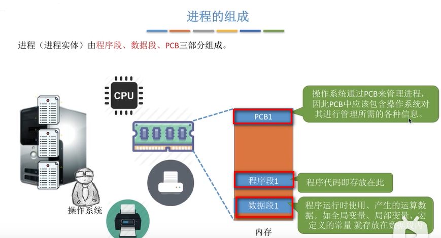

# 进程

## 为什么会有进程

说到进程，必须先说一下什么是程序？程序就是一个指令序列，早期的程序只支持单道程序，也就是说系统内的所有资源，包括 CPU，内存，I/O 设备都为这一个程序服务。但是后来发展到了多道程序，在操作系统内可以允许多道程序进行执行，内存中就会相应地有多道程序的执行数据，各个程序的代码，运算数据存放的位置不同，操作系统要怎么才能找到各个程序的存放位置了？同时系统中的 I/O 设备也会被分配给不同的程序，而哪些设备分配给了哪些程序，也需要记录下来。为了方便操作系统管理，完成各种程序并发执行，因此引入了进程、进程实体的概念。
操作系统在每次程序运行前，都会为这个程序配置一个数据结构，称为进程控制块(PCB),用来描述进程的各种信息(如代码存放位置)。我们常说的创建一个进程，实际上就是创建一个 PCB。

## 进程的定义

从不同的角度看，进程可以有不同的定义，比较传统典型的定义有：

1. 进程是程序的一次执行过程
2. 进程是一个程序及其数据在处理机上顺序执行时所发生的活动
3. 进程是具有独立功能的程序在数据集合上运行的过程，它是系统进行资源分配和调度的一个独立单位。

## 进程的组成

进程由程序段，数据段，PCB 三部分组成。

### PCB 进程控制块

PCB 中记录了进程的一些信息,主要包括进程描述信息，比如进程标识符 PID，每个进程都有一个唯一的标识符，yoghurt 标识符 UID 等，以及当前进程使用到的资源等，如下图所示：

我们可以通过任务管理器，查看计算机中一个进程的情况。

## 进程的特征

